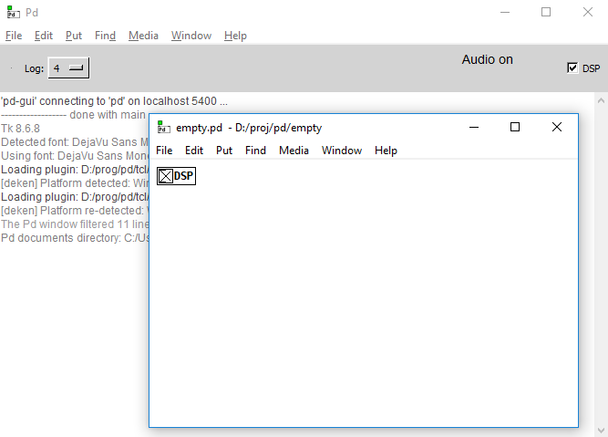

# What is it

[empty.pd](empty.pd) is a template which I use for all of my new projects.

# How to use it

Copy `empty.pd` and load it, or copy the DSP patch into your project.

# Why

When you open PureData, DSP and Audio are disable by default. So you need to enable them manually. It is tedious to enable DSP each time you open your patches, so it is usefult to enable them automatically on startup.

Thats what the DSP patch in the `empty.pd` does.
